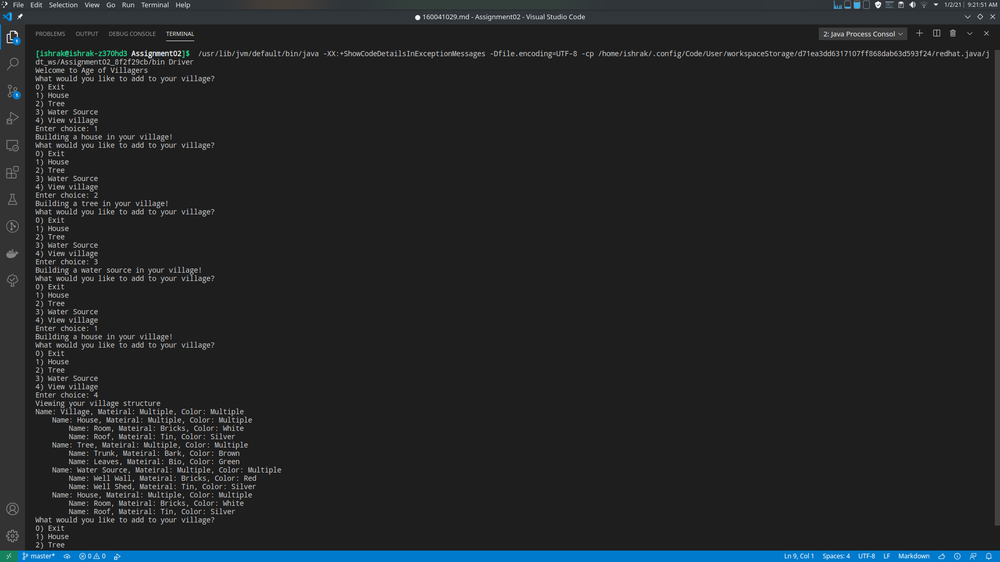

# Code Explanation
We know that in composite pattern, an object can be made up of similar type of objects. In this project, I have the class **BaseShape**. It has 4 member variables which are *name*, *material*, and *color*. The fourth member variable is a list of *BaseShape* objects called **partShapes**. This variable stores the shapes that make up the composite shape. A composite shape is made up off different basic shapes. In this project, the basic shapes are **Square**, **Triangle**, and **Circle**. Composite shapes are **House** (made up of basic shapes **Square** and **Triangle**), **Tree** (made from **Square** and **Circle**), and **WaterSource** (made from **Circle** and **Triangle**). 

*Driver.java* file has the main driver code. Running it will present the user with a welcome message and a menu in the console. From their the user will see 3 types of options which are
1. Exit program
2. Add composite shape
3. View

At the start of the program, the user has a shape called **village** which has an empty **partShapes** list. Using the menu mentioned above the user can add composite shapes like house, tree, and water source to this object. This is a way to adding structure objects just like in the game Age of Villagers. Finally, the user can view the entire composition of the village object using view option in the menu. A hierarchical representation of the village is presented to the user. A sample snippet is shown below

As the snippet shows, the user can add objects to his/her village and then view the structure of the village. It will print a hierarchical representation of the village.